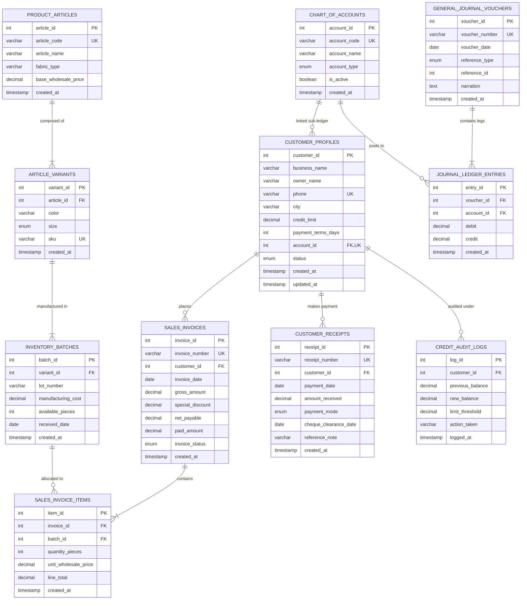

# Entity-Relationship Diagram & Data Dictionary

## Wholesale Apparel Multi-Tier Ledger & Udhaar Management System

This document provides the formal conceptual, logical, and physical database specifications for university DBMS evaluators and students. It details the **11 normalized entities (3NF compliant)**, complete data dictionary, and an interactive **Mermaid.js Crow's Foot ERD**.

---

## 1. Visual Entity-Relationship Diagram (Crow's Foot Notation)

---

## 2. Comprehensive Data Dictionary

### Table 1: `chart_of_accounts`
Maintains the general ledger master accounting chart supporting multi-tier sub-ledgers.
- **`account_id`**: `INT AUTO_INCREMENT` | **PK** | Surrogate primary key.
- **`account_code`**: `VARCHAR(20)` | **UNIQUE, NOT NULL** | Standard GAAP accounting numerical code (e.g., `1010` Cash, `1101` AR Sub-ledger).
- **`account_name`**: `VARCHAR(100)` | **NOT NULL** | Human-readable title of the accounting ledger head.
- **`account_type`**: `ENUM('Asset', 'Liability', 'Equity', 'Revenue', 'Expense')` | **NOT NULL** | Fundamental financial classification.
- **`is_active`**: `BOOLEAN` | **DEFAULT TRUE, NOT NULL** | Soft-deletion flag disabling retired accounts.
- **`created_at`**: `TIMESTAMP` | **DEFAULT CURRENT_TIMESTAMP** | Record creation timestamp.

---

### Table 2: `customer_profiles`
Wholesale apparel buyers, credit terms, and 1:1 integration to their dedicated AR sub-ledger.
- **`customer_id`**: `INT AUTO_INCREMENT` | **PK** | Unique customer identifier.
- **`business_name`**: `VARCHAR(150)` | **NOT NULL** | Registered commercial enterprise title.
- **`owner_name`**: `VARCHAR(100)` | **NOT NULL** | Legal representative or shop proprietor name.
- **`phone`**: `VARCHAR(25)` | **UNIQUE, NOT NULL** | Primary contact phone with international format.
- **`city`**: `VARCHAR(50)` | **NOT NULL** | Commercial distribution market hub (Lahore, Karachi, etc.).
- **`credit_limit`**: `DECIMAL(12,2)` | **CHECK (credit_limit >= 0), NOT NULL** | Maximum permissible outstanding udhaar ceiling.
- **`payment_terms_days`**: `INT` | **DEFAULT 30, NOT NULL** | Authorized credit period before default classification.
- **`account_id`**: `INT` | **FK, UNIQUE, NOT NULL** | 1:1 Foreign Key to `chart_of_accounts(account_id)`.
- **`status`**: `ENUM('Active', 'Blocked', 'Blacklisted')` | **DEFAULT 'Active'** | Operational credit state.
- **`created_at`**: `TIMESTAMP` | **DEFAULT CURRENT_TIMESTAMP** | Onboarding timestamp.
- **`updated_at`**: `TIMESTAMP` | **AUTO UPDATE** | Automatic modification timestamp.

---

### Table 3: `product_articles`
Master design catalog for apparel cuts and fabric styles.
- **`article_id`**: `INT AUTO_INCREMENT` | **PK** | Unique article identifier.
- **`article_code`**: `VARCHAR(30)` | **UNIQUE, NOT NULL** | Unique manufacturer design code (e.g., `ART-DNM-001`).
- **`article_name`**: `VARCHAR(100)` | **NOT NULL** | Commercial product title.
- **`fabric_type`**: `VARCHAR(50)` | **NOT NULL** | Material specification (e.g., `14oz Rigid Cotton Denim`).
- **`base_wholesale_price`**: `DECIMAL(10,2)` | **CHECK (> 0), NOT NULL** | Benchmark wholesale trade price per unit.
- **`created_at`**: `TIMESTAMP` | **DEFAULT CURRENT_TIMESTAMP** | Catalog insertion timestamp.

---

### Table 4: `article_variants`
Apparel color and size decomposition matrix.
- **`variant_id`**: `INT AUTO_INCREMENT` | **PK** | Unique variant identifier.
- **`article_id`**: `INT` | **FK, NOT NULL** | Reference to `product_articles(article_id)`.
- **`color`**: `VARCHAR(30)` | **NOT NULL** | Commercial shade (Indigo Blue, Jet Black, Khaki).
- **`size`**: `ENUM('S', 'M', 'L', 'XL', 'XXL', 'FreeSize')` | **NOT NULL** | Standard garment sizing code.
- **`sku`**: `VARCHAR(50)` | **UNIQUE, NOT NULL** | Globally unique Stock Keeping Unit identifier.
- **`created_at`**: `TIMESTAMP` | **DEFAULT CURRENT_TIMESTAMP** | SKU generation timestamp.
- **Composite Unique Constraint**: `(article_id, color, size)` prevents duplicate variations.

---

### Table 5: `inventory_batches`
Physical lot tracking and Cost of Goods Sold (COGS) basis.
- **`batch_id`**: `INT AUTO_INCREMENT` | **PK** | Unique production lot identifier.
- **`variant_id`**: `INT` | **FK, NOT NULL** | Reference to `article_variants(variant_id)`.
- **`lot_number`**: `VARCHAR(50)` | **NOT NULL** | Mill dyeing/stitching production lot stamp.
- **`manufacturing_cost`**: `DECIMAL(10,2)` | **CHECK (> 0), NOT NULL** | Unit production cost for COGS accounting.
- **`available_pieces`**: `INT` | **CHECK (>= 0), NOT NULL** | Physical unallocated stock pieces remaining in warehouse.
- **`received_date`**: `DATE` | **NOT NULL** | Date goods entered warehouse inventory.
- **`created_at`**: `TIMESTAMP` | **DEFAULT CURRENT_TIMESTAMP** | Record creation timestamp.
- **Composite Unique Constraint**: `(variant_id, lot_number)` ensures unique lot per variant.

---

### Table 6: `sales_invoices`
Wholesale credit bills representing commercial transactions.
- **`invoice_id`**: `INT AUTO_INCREMENT` | **PK** | Invoice surrogate key.
- **`invoice_number`**: `VARCHAR(30)` | **UNIQUE, NOT NULL** | Formatted invoice identifier (e.g., `INV-2026-001`).
- **`customer_id`**: `INT` | **FK, NOT NULL** | Reference to `customer_profiles(customer_id)`.
- **`invoice_date`**: `DATE` | **NOT NULL** | Commercial transaction date used for aging calculations.
- **`gross_amount`**: `DECIMAL(12,2)` | **CHECK (>= 0), NOT NULL** | Sum of line items before deductions.
- **`special_discount`**: `DECIMAL(10,2)` | **DEFAULT 0.00, NOT NULL** | Commercial discount allowed.
- **`net_payable`**: `DECIMAL(12,2)` | **CHECK (>= 0), NOT NULL** | Net claim against buyer (`gross_amount - special_discount`).
- **`paid_amount`**: `DECIMAL(12,2)` | **DEFAULT 0.00, NOT NULL** | Cumulative amount settled by customer.
- **`invoice_status`**: `ENUM('Unpaid', 'Partially_Paid', 'Paid', 'Cancelled')` | **DEFAULT 'Unpaid'** | Settlement status.
- **`created_at`**: `TIMESTAMP` | **DEFAULT CURRENT_TIMESTAMP** | Transaction audit timestamp.

---

### Table 7: `sales_invoice_items`
Granular line-item breakdown linking sales directly to inventory production lots.
- **`item_id`**: `INT AUTO_INCREMENT` | **PK** | Surrogate line identifier.
- **`invoice_id`**: `INT` | **FK, NOT NULL** | Parent bill reference in `sales_invoices`.
- **`batch_id`**: `INT` | **FK, NOT NULL** | Specific inventory batch deducted.
- **`quantity_pieces`**: `INT` | **CHECK (> 0), NOT NULL** | Volume of pieces billed.
- **`unit_wholesale_price`**: `DECIMAL(10,2)` | **CHECK (> 0), NOT NULL** | Selling price per garment.
- **`line_total`**: `DECIMAL(12,2)` | **CHECK (>= 0), NOT NULL** | Computed total (`quantity_pieces * unit_wholesale_price`).
- **`created_at`**: `TIMESTAMP` | **DEFAULT CURRENT_TIMESTAMP** | Line creation timestamp.

---

### Table 8: `general_journal_vouchers`
Immutable accounting voucher headers establishing financial audit trails.
- **`voucher_id`**: `INT AUTO_INCREMENT` | **PK** | Unique accounting voucher key.
- **`voucher_number`**: `VARCHAR(30)` | **UNIQUE, NOT NULL** | Official voucher sequence code (e.g., `JV-INV-000001`).
- **`voucher_date`**: `DATE` | **NOT NULL** | Financial posting date.
- **`reference_type`**: `ENUM('SALES_INVOICE', 'CUSTOMER_PAYMENT', 'SALES_RETURN', 'BAD_DEBT_WRITEOFF')` | **NOT NULL** | Transaction source origin.
- **`reference_id`**: `INT` | **NOT NULL** | Foreign entity identifier linking to originating document.
- **`narration`**: `TEXT` | **NOT NULL** | Detailed financial explanation of the posting.
- **`created_at`**: `TIMESTAMP` | **DEFAULT CURRENT_TIMESTAMP** | Accounting ledger timestamp.

---

### Table 9: `journal_ledger_entries`
Double-entry atomic legs. Enforces mathematical balance across financial transactions.
- **`entry_id`**: `INT AUTO_INCREMENT` | **PK** | Ledger leg key.
- **`voucher_id`**: `INT` | **FK, NOT NULL** | Parent voucher in `general_journal_vouchers`.
- **`account_id`**: `INT` | **FK, NOT NULL** | Target account in `chart_of_accounts`.
- **`debit`**: `DECIMAL(12,2)` | **CHECK (>= 0), DEFAULT 0.00** | Debit financial leg amount.
- **`credit`**: `DECIMAL(12,2)` | **CHECK (>= 0), DEFAULT 0.00** | Credit financial leg amount.
- **`created_at`**: `TIMESTAMP` | **DEFAULT CURRENT_TIMESTAMP** | Journal posting timestamp.
- **Mutual Exclusion Constraint**: `CHECK ((debit > 0 AND credit = 0) OR (debit = 0 AND credit > 0))` ensures an entry is strictly one-sided.

---

### Table 10: `customer_receipts`
Records monetary receipts clearing customer accounts receivable balances.
- **`receipt_id`**: `INT AUTO_INCREMENT` | **PK** | Unique payment receipt key.
- **`receipt_number`**: `VARCHAR(30)` | **UNIQUE, NOT NULL** | Printed commercial receipt sequence.
- **`customer_id`**: `INT` | **FK, NOT NULL** | Wholesale buyer making payment.
- **`payment_date`**: `DATE` | **NOT NULL** | Date funds were tendered.
- **`amount_received`**: `DECIMAL(12,2)` | **CHECK (> 0), NOT NULL** | Currency amount paid.
- **`payment_mode`**: `ENUM('Cash', 'Cheque', 'Online_Transfer')` | **NOT NULL** | Financial instrument used.
- **`cheque_clearance_date`**: `DATE` | **NULL** | Date cheque cleared bank (if applicable).
- **`reference_note`**: `VARCHAR(255)` | **NULL** | Bank transaction reference or cheque number.
- **`created_at`**: `TIMESTAMP` | **DEFAULT CURRENT_TIMESTAMP** | Receipt entry timestamp.

---

### Table 11: `credit_audit_logs`
Automated compliance logging tracking credit limit validations and status changes.
- **`log_id`**: `INT AUTO_INCREMENT` | **PK** | Audit sequence key.
- **`customer_id`**: `INT` | **FK, NOT NULL** | Audited buyer reference.
- **`previous_balance`**: `DECIMAL(12,2)` | **NOT NULL** | Prior ledger balance before transaction.
- **`new_balance`**: `DECIMAL(12,2)` | **NOT NULL** | Balance after transaction approval.
- **`limit_threshold`**: `DECIMAL(12,2)` | **NOT NULL** | Active credit limit ceiling at validation time.
- **`action_taken`**: `VARCHAR(100)` | **NOT NULL** | Outcome description (e.g., 'Invoice Authorized', 'Credit Block Enforced').
- **`logged_at`**: `TIMESTAMP` | **DEFAULT CURRENT_TIMESTAMP** | Audit record timestamp.

---

## 3. Structural Normalization Proof (3NF Compliance)

1. **First Normal Form (1NF)**:
   - All attributes contain strictly atomic, scalar values (no multi-valued lists or arrays stored in relational columns).
   - Each table possesses a guaranteed Primary Key.
   - Repeating groups (e.g., multiple line items per invoice) are factored into discrete dependent relation `sales_invoice_items`.

2. **Second Normal Form (2NF)**:
   - The relations are in 1NF.
   - All non-key attributes are fully functionally dependent on the entire Primary Key.
   - In composite-key relations like `article_variants` (`article_id, color, size`), attributes depend on the entire candidate key. No partial dependencies exist.

3. **Third Normal Form (3NF)**:
   - The relations are in 2NF.
   - There are **zero transitive functional dependencies** ($X \rightarrow Y$ and $Y \rightarrow Z$).
   - For example: Wholesale buyer city and credit limit are not duplicated in `sales_invoices`; they reside solely in `customer_profiles`.
   - Inventory manufacturing cost is isolated to `inventory_batches` rather than duplicated in `sales_invoice_items`.
